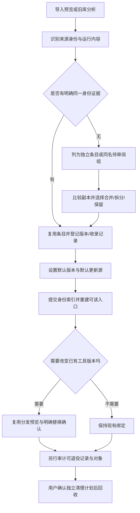

# Skill 库多来源与统一目录优化方案

> 2026-09-21 状态补充：本方案中的稳定身份、默认版本、迁移及回收设计仍待评审。当前已完成的同实体分发与版本展示见 [实体分发说明](../../../specs/entity-distribution.md)，重加目标自动绑定见 [目标绑定恢复](../../../specs/target-binding-recovery.md)。本草案不代表这些后续设计已经实现。

状态：待评审，尚未实施。范围为方案与文档；不执行真实库迁移、切换或清理。

## 1. 需求背景

用户连续反馈两个问题：同名 Skill 出现多份来源；统一目录 `objects` 中存在大量不易辨认的哈希文件夹。

当前实现将不同来源成员保存为独立 `Skill`，前端 `librarySkills()` 按名称聚合；对象则按完整来源包的内容摘要保存。列表的一行、来源的一条记录、对象的一个目录不是同一粒度。因此“合并成一行”并未实现身份统一，“集中存储”也不等于每个 Skill 只有一份物理内容。

2026-09-15 本机只读快照（revision 103、schemaVersion 2）：260 条记录、130 个名称、66 个名称有多条记录；18 个对象目录，当前 Skill 引用 10 个非空摘要，59 条记录为外部引用。数量仅是观测基线，不代表有 8 个对象可删除，也未证明 66 组内容相同。

业务规则和验收要求见 [结构化需求](结构化需求.md)。本方案以当前代码为依据；不沿用历史笔记中已过时的“清理未接入”判断，当前已存在对象清理 API。

## 2. 设计目标

**推荐：建立稳定 Skill 身份和默认版本，增加可读目录入口；保留完整包快照，分阶段整合记录与回收历史对象。**

| 用户需要知道 | 优化后呈现 |
| --- | --- |
| 我有哪个 Skill | 一个稳定逻辑条目；真正不同的同名 Skill 可分开命名 |
| 默认分发哪份 | 明确的默认版本；尚未选择时显示“待选择版本” |
| 从哪里更新 | 单独显示默认更新源，未配置时明确为空 |
| 最早从哪里收录 | 详情里的收录记录，保留来源追溯 |
| 工具实际用哪份 | 工具行展示实际版本和固定/跟随/外部引用状态 |
| 去哪里看文件 | “打开 Skill 目录”进入可读入口；高级页解释内部对象 |
| 能清理多少 | 基于完整引用审计的独立预览，不用目录数量推算 |

不将“所有对象只剩一个”“同名全部合并”设为成功指标，也不承诺第一阶段释放空间。

## 3. 实现方案

### 3.1 整体设计

#### A. 身份、版本、来源与安装分层

新增 `LibraryEntry` 作为逻辑身份，关联现有来源成员记录；现有 `Skill`、`Source`、`Binding`、预设锁和包引用继续存在。完整字段及接口定义统一见 [前端接口文档](前端接口文档.md)。

- `LibraryEntry.id` 独立于名称、文件路径和摘要；默认版本及默认更新源必须持久化，不再依赖安装时间排序隐式选择。
- 收录记录用于追溯，不等于更新源；多个记录可归属一个逻辑条目而不触发实体删除。
- 默认源变化只影响该条目后续默认版本；其他候选源即使有更新，也不能静默替代默认内容。
- 来源包的抓取任务按既有来源去重；同一包内可只有部分成员选择跟随这个默认源。原本锁定的预设及显式选择其他来源的安装继续按自己的绑定规则执行。
- 显示名变更不修改 `SKILL.md`、成员相对路径或工具现有安装目录名。

#### B. 去重与冲突规则

| 场景 | 身份处理 | 实体/工具处理 |
| --- | --- | --- |
| 同一真实实体被多处软链引用 | 复用已有记录，记录各安装位置 | 保持实体与借用链接所有权 |
| 相同已验证来源标识及成员路径 | 同一逻辑 Skill 的版本链 | 内容更新按原来源和锁定规则处理 |
| 同名、独立目录内容相同且完整运行依赖可证明等价 | 提示可整合，选择保留默认版本 | 默认仅整合身份；工具切换另行预览 |
| Skill 目录相同，但共享资源、执行权限、链接或包上下文不同 | 标记不同/无法确认 | 不自动物理去重、不替换安装 |
| 同名内容不同或作者/用途不同 | 比较后合并为版本候选，或拆为独立条目 | 用户选择默认版和明确目标后才能切换 |
| 不同名称内容相同 | 默认保留不同逻辑条目 | 可复用完整相同对象；不以内容哈希合并身份 |
| 本地引用或依赖包外路径 | 保持独立引用语义，比较结果允许未知 | 不复制接管、不自动删除原位置 |

“内容相同”必须检查文件字节、相对路径、执行权限、符号链接目标及共享依赖。原始包摘要只适合完整包复用，不适合直接断言某个 Skill 相同。沿用版本化摘要算法及 `.DS_Store` 兼容，不重新解释旧摘要。

任意脚本可能动态读文件，不能靠静态扫描完整推断依赖。首期默认将整个原包作为依赖边界；只有明确独立的 Skill 或具有可验证依赖声明的包才允许细粒度等价判定。未知时保留，不假定安全。

#### C. 可读目录与内部存储

```text
统一目录/
├── skills/                         # 应用生成的浏览入口
│   ├── code-review -> ../objects/<摘要>/tree/code-review
│   └── jira        -> ../objects/<摘要>/tree/jira
├── objects/<摘要>/tree/             # 完整来源包的版本快照，首期路径不变
├── state.json                      # 权威索引、默认版本及既有关系
├── library-view.json               # 派生入口清单、所有权及生成 revision
├── backups/                        # 原目录恢复备份，沿用现有语义
├── transactions/                   # 事务日志、迁移恢复清单
├── cache/                          # 来源获取缓存
└── trash/                          # 沿用现有回收流程
```

- `skills/` 只生成已选默认版本的入口；未决冲突在 UI 处理，不能随意选一份生成链接。P0 尚无新身份索引时，只为唯一无歧义的既有记录生成入口；多份记录保留原选择流程，到 P1 明确默认版本后再生成稳定入口。
- 入口名使用安全显示名；按大小写不敏感及 Unicode 规范化检测碰撞，禁止路径穿越和 Windows 保留名称。冲突统一加稳定 ID 短后缀并持久化，不能随显示顺序改变。
- 不移动、改名或隐藏真实 `objects` 文件夹。高级“存储管理”展示对象所属包、版本、占用、保留原因；主入口默认打开 `skills/`。
- 工具分发仍直达已解析的具体对象版本，不链接到可变的 `skills/` 默认入口，防止默认版本切换绕过固定版本限制。
- 生成目录不再作为导入或归集来源；在路径规范化、真实路径解析和根目录包含关系检查处排除内部目录，防止循环收录。
- 入口是浏览视图，不是新的实体副本；它可以重建。符号链接本身不提供只读保护，不能宣传为“只读文件夹”。需要编辑时引导复制到工作目录后重新收录；发现对象被外部修改时沿用完整性校验阻止覆盖/分发。
- 跨平台复用现有目录链接抽象。Windows 无法创建链接时不以复制回退：UI 仍可按名称浏览并打开具体实体，提示磁盘入口未生成；核心读写不受可读视图失败影响。
- 浏览入口不作为原始脚本的新增执行入口；相对路径、脚本定位和软链行为需在隔离数据中验证，保留整个包并不意味着所有工具都能从任意别名路径运行。

#### D. 空间治理

第一步先解释对象：当前库使用、工具固定版本、预设引用、恢复所需、历史保留、未能核验六类引用原因，可同时存在。

复用 `preview_object_cleanup()`、`cleanup_objects()` 和重试机制，扩展其引用集合以包含新逻辑索引、默认版本、迁移备份、未完成计划。每个对象展示保留原因；缺失/不可读的引用证据使该对象不可清理。

身份整合不立刻清理旧记录/旧对象。后续“整理重复副本”需要先处理绑定和预设引用，再经独立预览退役无用记录，最后才进入对象清理。无法证明依赖等价的完整包继续共存。

保留完整包级去重，首期不引入逐文件硬链接或新的文件 CAS：硬链接共享写入风险、包布局和跨平台复杂性不值得与身份迁移同时引入。可另评估文件系统克隆降低写入量，但不改变逻辑引用，也不承诺可移植节省比例。

### 3.2 总体流程



**迁移执行边界：**

1. 只读生成完整清单：来源/记录/对象/绑定/预设锁/外部安装/备份/未完成事务。存在恢复任务时先恢复，不进入迁移。
2. 预览展示将创建的逻辑条目、同名待审阅组、入口路径冲突和无效记录。明确来源身份的记录自动关联；仅凭同名的记录不自动折叠为永久身份，也不默认切换工具。
3. 保存计划 token、原 revision、映射、相关摘要、链接文本和有效期。token 绑定唯一操作范围，后端生成并保存；客户端不能改写计划。
4. 持有现有进程/库写锁，暂停新调度写入；正在执行的任务完成后再进入。重新校验所有条件，生成独立迁移备份及 journal。
5. 使用现有文件事务协议提交新索引，保留原 `Skill.id`、绑定 ID、引用声明、原始备份。新格式只读/写兼容 gate 必须在任何观察/修复动作之前检查。
6. 作为派生任务生成 `skills/`；按清单校验旧入口再替换，不覆盖用户已有目录。入口生成失败标为可重建，不回滚已经有效的权威索引，也不误报全部迁移成功。
7. 后续合并、拆分或默认选择走相同预览—执行协议；旧 API 的导入、删除、来源更新也必须同步维护索引，不能产生悬空归属。
8. 回滚只恢复此次操作拥有且仍符合预期的路径和状态。迁移后已发生新写入时不能直接覆盖旧快照，必须采用当前版本的反向计划；无法安全逆转则保留现状、人工审阅。

**复用与拟新增后端入口：**

| 模块 | 签名/入口 | 职责与事务 |
| --- | --- | --- |
| 现有分发 | `build_plan` / `distribute` / `replaceBindingIds` | 保留来源切换授权、共享引用阻塞和外部链接恢复行为 |
| 现有快照 | `snapshot_tree_with` / `snapshot_matches` | 完整包校验与复用，不迁移原对象路径 |
| 拟新增身份模块 | `preview_library_migration(&self) -> Result<LibraryPlan>` | 只读分析、token 快照 |
| 拟新增身份模块 | `apply_library_migration(&self, token: &str, expected_revision: u32) -> Result<LibraryOperationResult>` | 独占写锁、journal、原子索引提交 |
| 拟新增决策模块 | `preview_library_decision(&self, decision: LibraryDecision) -> Result<LibraryPlan>` | 合并/拆分/默认选择，冻结影响范围 |
| 拟新增决策模块 | `apply_library_decision(&self, token: &str, expected_revision: u32) -> Result<LibraryOperationResult>` | 再校验并提交，不隐式切换工具 |
| 拟新增视图模块 | `rebuild_library_view(&self, expected_revision: u32) -> Result<LibraryViewResult>` | 可重试派生任务、所有权清单和路径冲突保护 |
| 现有清理 | `preview_object_cleanup` / `cleanup_objects` / `retry_object_cleanup` | 增加新引用根、原位展示阻塞原因 |

所有新接口的错误码及完整契约见接口文档；计划过期、依赖未核验、路径占用、恢复任务、格式不兼容分别处理，不统一显示“失败”。

### 3.3 监控报警

本项目为本地桌面工具，无对应 SLS/SQL/神策或 Multica 业务监控源，不新增云端自动监控与数据上传。采用本地任务结果和按需完整性检查，不生成虚构监控配置。

| 本地观察项 | 来源/频次 | 正常标准 | 异常动作 |
| --- | --- | --- | --- |
| 条目索引完整性 | 每次相关事务提交及启动诊断 | 无悬空默认记录、重复记录归属 | 拒绝提交或暂停相关写入 |
| 分发变化 | 计划与 journal | 实际修改集合不超出确认集合 | 回滚并保留恢复任务 |
| 可读入口完整性 | 重建结束；用户主动诊断 | 与清单一致，无外部目录被覆盖 | 标记待重建，仅重试归属明确的入口 |
| 清理安全 | 每次清理预览/执行 | 被删对象无有效引用，摘要未变 | 停止该对象，刷新计划 |

### 3.4 数据验证

数据存储为本地 JSON 和文件，不适用 SQL；用只读验证器加载索引、事务清单及 `lstat/read_link` 结果，禁止为核验而修复数据。

- 迁移前后原记录及来源数量保持，原 ID、预设锁和备份可追溯；身份数量允许因明确合并/拆分变化。
- 首次索引迁移前后所有现有工具的链接文本、解析实体和实际文件摘要相同；不是仅比较 `Binding` 数量。
- 每个有效记录恰好归属一个逻辑条目，默认记录属于该条目；无效遗留记录进入待处理清单，不被静默丢弃。
- 用户未选择的工具、受其他预设保护的绑定和借用链不变。库版本变化与工具版本变化分别记录。
- 按唯一物理对象统计逻辑大小和可获得的已分配大小；硬链接/克隆及文件系统回收差异使“预估可回收”不同于最终磁盘增量。

自动化 Case（语义设计，本阶段不编写/运行测试）：

| 场景 | 操作 | 关键断言 |
| --- | --- | --- |
| 三工具同名副本 | 分析、确认身份整合、选择默认版 | 一个逻辑条目，来源追溯完整，三工具指向不变 |
| 同 Skill 目录、不同共享脚本 | 执行重复分析 | 不判为可物理去重，差异原因明确 |
| 固定版本与预设共用 | 改默认版，再预览工具切换 | 默认变化不动旧绑定；共享引用明确阻塞 |
| 迁移与来源检查并发 | 预览后执行来源更新，再提交 | 旧计划拒绝，无部分写入 |
| 生成入口时崩溃或路径被占用 | 恢复/重建 | 权威索引有效、无外部覆盖、重复执行幂等 |
| 清理时新增引用 | 清理预览后新增预设锁 | 旧计划拒绝；历史对象保留 |
| 默认源变更 | 旧源产生更新、新源检查 | 旧源不覆盖新默认；明确选择旧源的绑定仍受原规则控制 |
| 旧版程序打开新库 | 读取/尝试写入 | 格式 gate 拒绝，不触发降级写入 |

## 4. 相关改动

### 4.1 代码

| 涉及服务 | 改动文件 | 类型 | 字段/方法 | 说明 |
| --- | --- | --- | --- | --- |
| Rust 核心 | `model.rs`、拟新增 `library_identity.rs` | 新增/扩展 | `Snapshot`、`LibraryEntry` | 逻辑身份、默认选择和校验 |
| Rust 核心 | `lib.rs` | 扩展 | `snapshot`、`execute_request`、事务与恢复 | 格式 gate、新动作路由、索引一致性 |
| Rust 核心 | `operations.rs`、`source_binding.rs`、`git_packages.rs` | 扩展 | 导入/更新/来源绑定/删除/分发 | 更新索引与默认源归属，不引入隐式替换 |
| Rust 核心 | `packages.rs`、`local_sources.rs`、`local_presets.rs` | 扩展 | 包成员/来源同步/预设应用 | 成员增删、共享引用和锁定完整性 |
| Rust 核心 | `backups.rs`、`portable.rs` | 扩展 | 恢复、迁移、导入导出 | 新索引与备份可逆；排除派生入口，导入后重建 |
| Rust 核心 | `files.rs`、拟新增 `library_view.rs` | 扩展 | 摘要/路径/链接与重建 | 依赖边界、入口所有权、跨平台冲突处理 |
| Rust 核心 | `object_cleanup.rs` | 扩展 | 引用遍历与清理预览 | 纳入新索引和迁移恢复引用 |
| 前端服务 | `api.ts`、生成的 `types.ts`、`demo.ts` | 扩展 | 新 DTO 与动作 | 真实/演示契约一致；类型继续从 Rust 生成 |
| 前端状态 | `stores/app.ts`、`librarySkills.ts` | 修改 | 条目/筛选/数量 | 改按稳定身份映射，保留同名待审阅组 |
| 前端页面 | `LibraryPage.vue`、`SkillDetailSheet.vue`、`UpdatesPage.vue` | 修改 | 版本/来源/收录/实际安装 | 消除“多来源”概念混用，统一所有展示入口 |
| 前端分发 | `useLibraryDistribution.ts`、`DistributionDialog.vue` | 修改 | 默认解析/显式切换 | 复用现有预览和替换授权 |
| 前端目录/存储 | `SkillDirectoryActions.vue`、`SettingsPage.vue` | 扩展 | 浏览入口/对象占用 | 可读入口与高级对象管理 |
| 桌面/CLI | `src-tauri/src` 目录打开/命令入口、`crates/skilldock-cli/src` | 扩展 | 动作转发/格式校验/诊断 | 新格式写入 gate 必须全入口生效，路径打开受控 |
| 测试 | Rust 集成测试、前端交互验证、类型导出检查 | 新增/扩展 | 迁移/恢复/身份/路径/引用 | 重点验证真实文件与软链行为 |

### 4.2 数据

无 SQL 数据库变更。持久化 JSON 新索引及版本门禁见接口文档；原始对象路径不变。新 DTO 必须同步导出、演示数据、导入导出、日志恢复、清理遍历和 CLI 兼容校验。

### 4.3 配置

无 nacos/etcd。可读入口、写入迁移和清理功能分阶段启用；迁移预览不自动打开迁移开关。目录根沿用用户已有配置。

### 4.4 其他依赖

复用现有文件事务、摘要、链接实现和 Reka UI，不新增数据库服务或内容存储服务。依赖声明格式的细粒度去重留到后续独立评审。

## 5. 风险评估

最高风险是错误合并身份后，更新/清理影响原本独立的内容；其次是新格式被旧客户端写坏。

| 风险 | 应对 |
| --- | --- |
| 只比较 Skill 目录漏掉共享依赖 | 默认完整包边界，未知禁止物理去重 |
| 选择默认版本影响固定安装 | 工具直接指向具体版本，变更既有绑定单独授权 |
| 用户编辑可读链接影响实体 | 不宣称链接只读；提供工作副本编辑路径，完整性检查阻止继续分发 |
| 旧版忽略新字段/格式 | 迁移使用新 schema；所有写入口提前 gate，拒绝旧程序就地写入 |
| 中断、低磁盘空间及目标外部变化 | 预览估算、原子索引、journal、幂等恢复；清理与迁移分离 |
| 过早清理导致回滚失败 | 迁移备份与未完成计划均为强引用，回滚窗口内不清相关对象 |

## 6. 排期

估算为实现与验证工作量，不是承诺交付日期；依赖跨平台文件行为验收。

| 阶段 | 交付 | 估算 |
| --- | --- | --- |
| P0 可理解 | 区分术语、实际版本展示、存储分类、按需生成可读入口 | 2–3 人日 |
| P1 可统一 | 稳定身份索引、默认源/版本、整合与拆分、兼容迁移 | 4–6 人日 |
| P2 可回收 | 重复记录退役、完整引用审计、复用安全清理 | 2–3 人日 |
| 验收与发布 | 故障恢复、旧库升级、三系统真实路径与分发回归 | 2–3 人日 |

建议首个可用版本交付 P0；身份统一在 P1 完成。物理空间回收以 P2 独立验收，不将 P0 的可读入口误称为实体去重。

## 7. 上线方案

- [ ] 先用合成隔离库和用户库的只读统计复核映射规则，不操作真实来源目录。
- [ ] 旧格式读取、新格式拒绝写入、默认源过滤与引用遍历测试通过。
- [ ] 迁移中断、入口占用、磁盘不足、外部内容变更和回滚测试通过。
- [ ] 首次真实迁移展示完整预览，由用户确认；保留可验证备份，暂停并发写入。
- [ ] P0 不搬对象；P1 不自动切链接和删对象；P2 清理独立预览确认。
- [ ] 完成 Mac/Windows/Linux 文件行为及实际工具运行验证，再打包发布；CI 成功不代替真实路径验收。
- [ ] 需要降级时先用支持新格式的版本导出或执行反向计划，不能直接安装旧版覆盖新库。

## 8. 其他相关信息

当前可复用规则：[分发来源切换](../../../specs/distribution-source-switch.md)、[来源更新规则](../../../source-update-policy.md)、[界面与存储约束](../../../../DESIGN.md)。

需要实施前评审的产品选择：是否接受不同用途的同名 Skill 显示为独立条目；是否将可读目录仅作为浏览入口。本文采用两项均接受的推荐方案，未视为用户已确认。

本次仅新增方案文件，未执行合并、迁移、分发切换、对象删除、提交或发布。
